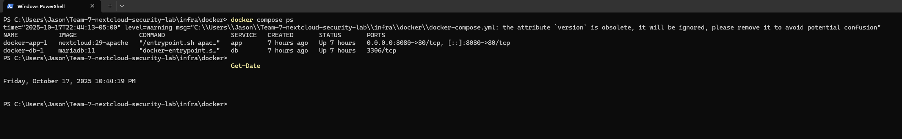
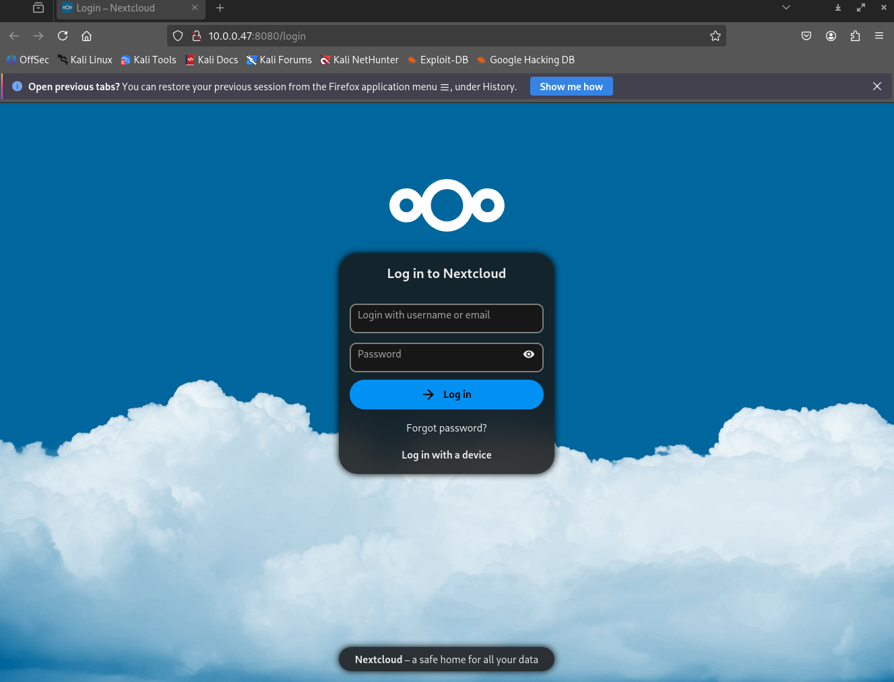
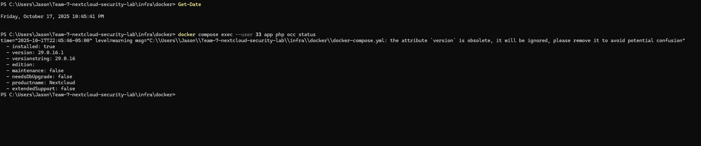

# Week 0 — Environment Verification (Findings)

## Summary
Baseline lab stood up. Nextcloud `29.0.16` reachable from Kali. App and DB containers running. No data or users leaked. Evidence below.

## Evidence
- `docker compose ps` on host shows `app` and `db` healthy and port mapping `8080->80`.
- Nextcloud login screen reachable from Kali at `http://10.0.0.47:8080/login`.
- `occ status` reports version and install state using web user id 33.

### Screenshots
1) Host containers

2) Kali browser reachability

3) Nextcloud app status

## Findings
- Exposure: Lab uses HTTP on 8080 only. No TLS yet.
- Surface: Only ports seen from compose are 8080/tcp (app via host) and 3306/tcp (db inside Docker network). DB not exposed to host.
- Permissions: `occ` must run as uid 33. Host root cannot operate app commands directly.
- Version pin: `29.0.16.1` confirms baseline for CVE checks in Week 2+.

## Actions
- Plan HTTPS reverse proxy for 443 with nginx in Week 2.
- Add `docs/evidence/week0/` references to README.
- Create test users `alice` and `bob` and seed files in Week 1 close-out.
