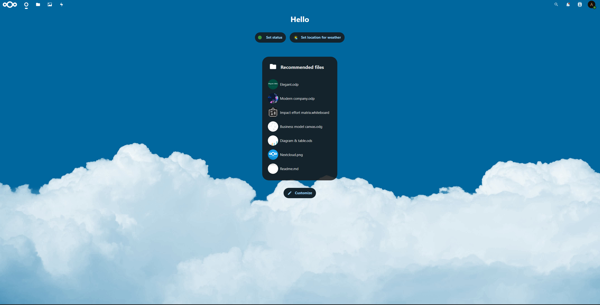
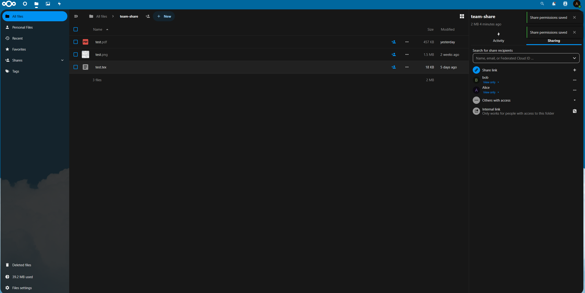
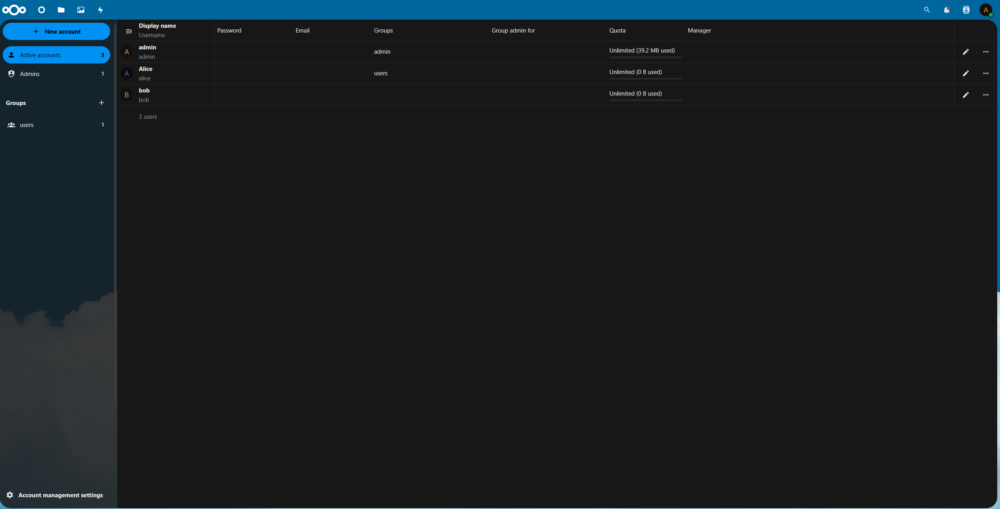

# Week 1 — Accounts, Sharing, Surface (Findings)

## Summary
Lab users created. Team share set with least-privilege. External surface limited to HTTP on 8080. Evidence below.

## Evidence
- **Dashboard reachable** from Kali after initial setup.
- **Users**: `admin`, `alice` (group `users`), `bob` (group `users`). Quotas unlimited in lab.
- **Team share** folder with explicit permissions: `alice` view-only, `bob` view-only, link sharing toggled per UI.
- **Port scan** of host shows only 8080/tcp open.

### Screenshots
1) Setup dashboard  

2) Team share permissions  

3) User list  

### Nmap result (local host `10.0.0.47`)
File: `scans/nmap-local.txt`
