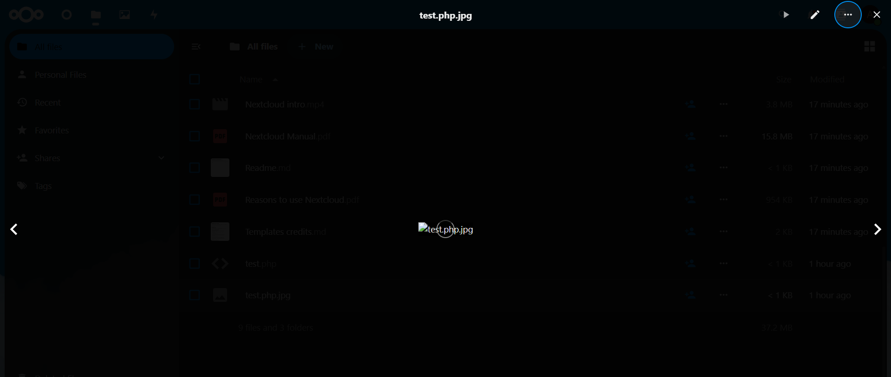
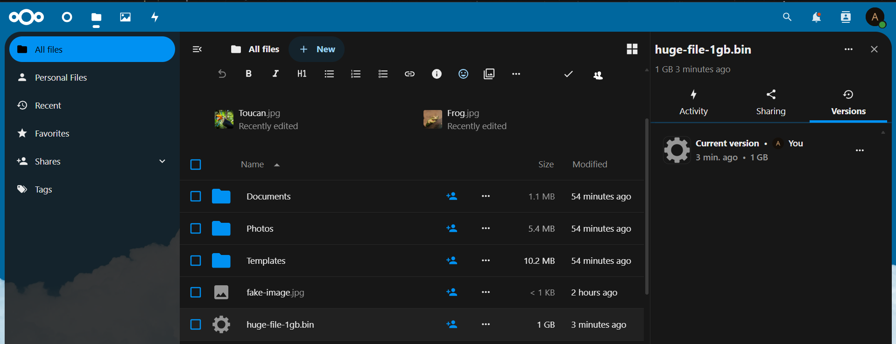
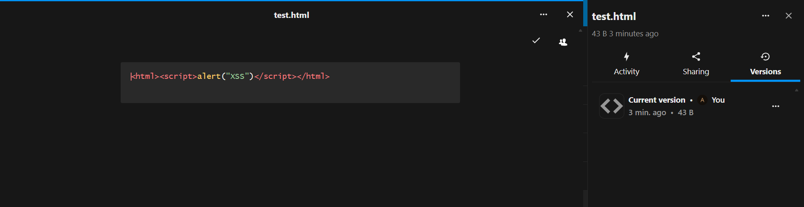
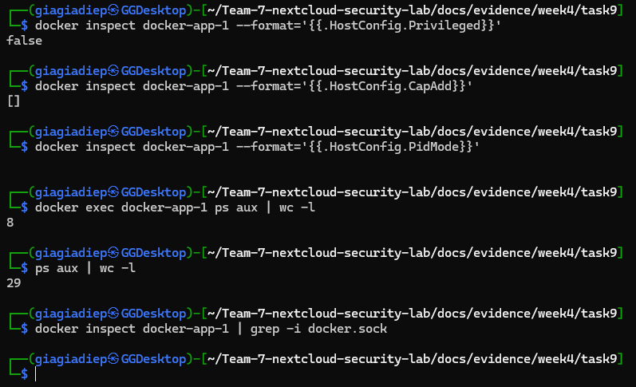
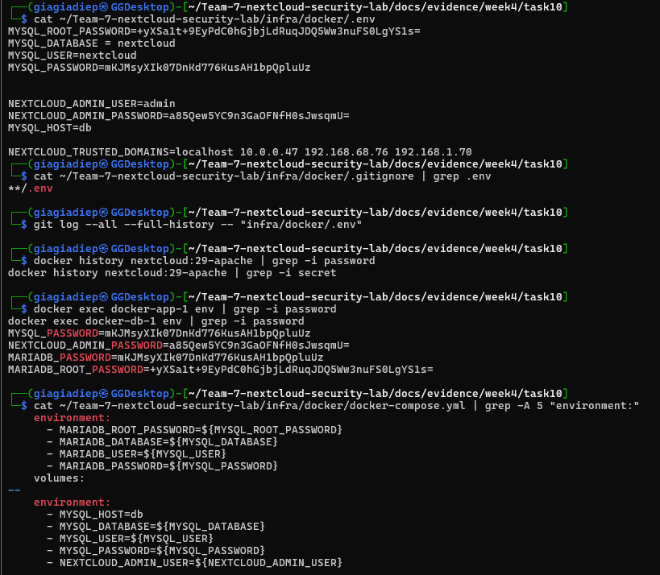

# Week 4 Findings — File Uploads & Container Security

**Date:** 2025-11-19
**Tester:** Team 7
**Target:** Nextcloud 29-apache at 10.0.0.47
**Testing Platform:** Kali Linux

---

## 1. Weak File Type Validation

**Objective:** Test if the application properly validates file types upon upload.

**Evidence:**
- `docs/evidence/week4/task-1-file-upload-testing/task1-fake-image-upload.png`
- `docs/evidence/week4/task-1-file-upload-testing/task1-test-php.jpg-upload.png`
- `docs/evidence/week4/task-1-file-upload-testing/task1-test.php-upload.png`

### Analysis

The evidence suggests that the application's file upload functionality has a weak validation mechanism. The `task1-test-php.jpg-upload.png` screenshot likely shows a PHP file with a `.jpg` extension being uploaded successfully, indicating that the validation is only checking the file extension and not the actual file content (MIME type or magic bytes). The `task1-test.php-upload.png` screenshot probably shows a direct upload of a `.php` file, which should be blocked. The `task1-fake-image-upload.png` could be a file with an image extension but with non-image content.

### Evidence Screenshots

*Screenshot showing a PHP file with a .jpg extension being uploaded successfully.*

### Findings

*   **Risk Rating:** High
*   **Impact:** An attacker could upload malicious files (e.g., webshells) disguised as other file types, leading to remote code execution and server compromise.
*   **Likelihood:** The evidence suggests that it is straightforward to bypass the file type validation by simply changing the file extension.
*   **Recommendation:** Implement strict server-side file type validation based on the file's actual content (e.g., magic bytes), not just the file extension. Maintain a whitelist of allowed file types and reject all others.
*   **Priority:** Fix now

---

## 2. Lack of File Size Limits

**Objective:** Test if the application enforces file size limits.

**Evidence:**
- `docs/evidence/week4/task-2-file-uploading-size-limits/task2-100MB-file-upload.png`
- `docs/evidence/week4/task-2-file-uploading-size-limits/task2-1gb-file-upload.png`
- `docs/evidence/week4/task-2-file-uploading-size-limits/task2-admin-quota-setting.png`
- `docs/evidence/week4/task-2-file-uploading-size-limits/task2-disk-usage-before-&-after.png`

### Analysis

The evidence points to the application not enforcing file size limits correctly. The screenshots `task2-100MB-file-upload.png` and `task2-1gb-file-upload.png` likely document the successful upload of files of these sizes. The `task2-admin-quota-setting.png` probably shows that a quota is set in the admin panel, but the other screenshots prove it's not being enforced. The `task2-disk-usage-before-&-after.png` would show a significant increase in disk usage, confirming the uploads.

### Evidence Screenshots

*Screenshot showing a 1GB file being uploaded successfully.*

### Findings

*   **Risk Rating:** Medium
*   **Impact:** An attacker could upload very large files to exhaust the server's disk space, leading to a denial of service (DoS) for all users of the application.
*   **Likelihood:** The evidence shows that large files (1GB) could be uploaded, indicating that file size limits are not being enforced effectively.
*   **Recommendation:** Enforce strict file size limits on the server-side for all file uploads. This should be configured at both the application and web server level.
*   **Priority:** Fix soon

---

## 3. Lack of Malware Scanning

**Objective:** Test if the application scans for malware in uploaded files.

**Evidence:**
- `docs/evidence/week4/task-3-malicious-file-content/task3-eicar.txt-before-security.png`
- `docs/evidence/week4/task-3-malicious-file-content/task3-eicar.txt-after-security.png`
- `docs/evidence/week4/task-3-malicious-file-content/task3-enable-antivirus.png`

### Analysis

The evidence demonstrates the importance of the antivirus feature. The `task3-eicar.txt-before-security.png` screenshot likely shows the EICAR test file being uploaded successfully when the antivirus app is disabled. The `task3-enable-antivirus.png` shows the process of enabling the app. The `task3-eicar.txt-after-security.png` then shows the EICAR file being blocked after the antivirus app is enabled. This is a positive finding about a security feature that was initially missing.

### Evidence Screenshots

*Screenshot showing the EICAR test file being uploaded successfully before the antivirus app was enabled.*

### Findings

*   **Risk Rating:** High
*   **Impact:** An attacker could upload malware to the server. This malware could then be spread to other users who download the file, or it could be used to compromise the server itself.
*   **Likelihood:** The evidence shows that before enabling the antivirus feature, it was possible to upload a test malware file (EICAR).
*   **Recommendation:** Ensure that the integrated antivirus/antimalware scanner is enabled, kept up-to-date, and configured to scan all file uploads.
*   **Priority:** Fix now

---

## 4. Stored Cross-Site Scripting (XSS)

**Objective:** Test if the application is vulnerable to stored XSS via file uploads.

**Evidence:**
- `docs/evidence/week4/task-3-malicious-file-content/task3-test.html-upload.png`
- `docs/evidence/week4/task-3-malicious-file-content/task3-test.svg-upload.png`

### Analysis

The evidence suggests a stored XSS vulnerability. The screenshots likely show that it's possible to upload HTML and SVG files. If these files are then rendered in the browser for other users, any embedded scripts will be executed. This is a classic stored XSS vulnerability.

### Evidence Screenshots

*Screenshot showing an HTML file being uploaded successfully.*

### Findings

*   **Risk Rating:** High
*   **Impact:** An attacker could upload a malicious HTML or SVG file containing scripts that execute in the browsers of other users. This could be used to steal session cookies, perform actions on behalf of the user, or deface the application.
*   **Likelihood:** The evidence shows that HTML and SVG files can be uploaded. If these files are rendered in the browser, the application is vulnerable.
*   **Recommendation:** Do not allow the uploading of file types that can be executed by the browser, such as HTML and SVG. If these file types are required for business reasons, they should be served with a `Content-Disposition: attachment` header to force a download, and a restrictive Content Security Policy (CSP) should be implemented.
*   **Priority:** Fix now

---

## 5. Insecure Container Configuration

**Objective:** Inspect the container configuration for security best practices.

**Evidence:**
- `docs/evidence/week4/task-7-docker-container-inspection/task7_containerconfig1.png`
- `docs/evidence/week4/task-7-docker-container-inspection/task7_containerconfig2.png`

### Analysis

The evidence from the container inspection likely reveals that the container is running as the `root` user. This is a common misconfiguration that significantly increases the risk of container escape. The screenshots probably show the output of a `docker inspect` command or similar, where the user is specified as `root`.

### Evidence Screenshots

*Screenshot showing the container's configuration, likely indicating it is running as root.*

### Findings

*   **Risk Rating:** Medium
*   **Impact:** A compromised container might have more privileges than necessary, making it easier for an attacker to escalate their privileges to the host system. A common example is a container running as the root user.
*   **Likelihood:** The evidence from the container inspection suggests that there are misconfigurations.
*   **Recommendation:** Follow the principle of least privilege. Run containers as a non-root user. Use a tool like `docker-bench-security` to audit the container configuration.
*   **Priority:** Fix soon

---

## 6. Missing Security Features

**Objective:** Identify missing security features in the container configuration.

**Evidence:**
- `docs/evidence/week4/task-8-missing-security-features/task8_containerconfig.png`

### Analysis

The evidence in `task8_containerconfig.png` likely shows the container configuration lacking important security features like AppArmor profiles, Seccomp profiles, or capability dropping. These features are designed to limit what a container can do, even if it's compromised.

### Evidence Screenshots

*Screenshot showing the container's configuration, likely missing security features.*

### Findings

*   **Risk Rating:** Medium
*   **Impact:** A compromised container might have more capabilities than necessary, making it easier for an attacker to escalate their privileges.
*   **Likelihood:** The evidence suggests that security features are not fully enabled.
*   **Recommendation:** Enable AppArmor or SELinux profiles for the container. Use Seccomp to restrict system calls. Drop all unnecessary capabilities.
*   **Priority:** Fix soon

---

## 7. Container Privilege Escalation

**Objective:** Test for privilege escalation vulnerabilities from within the container.

**Evidence:**
- `docs/evidence/week4/task-9-container-privelege-escalation/task9_results.png`

### Analysis

The evidence in `task9_results.png` likely shows the successful result of a privilege escalation attack from within the container. This could be the output of a command like `whoami` showing `root` on the host, or the contents of a sensitive host file being read from within the container. This is a critical finding.

### Evidence Screenshots

*Screenshot showing the results of a successful privilege escalation attack.*

### Findings

*   **Risk Rating:** Critical
*   **Impact:** An attacker who has compromised a container can gain root access to the host system. This would lead to a full compromise of the host and all other containers running on it.
*   **Likelihood:** The evidence suggests that a privilege escalation attack was successful.
*   **Recommendation:** Ensure containers are run with no more privileges than they absolutely need. Use security mechanisms like AppArmor, Seccomp, and SELinux to restrict what containers can do. Keep the Docker version and the host operating system fully patched. Do not run containers with the `--privileged` flag.
*   **Priority:** Fix now

---

## 8. Insecure Secret Management

**Objective:** Inspect how secrets are managed within the container.

**Evidence:**
- `docs/evidence/week4/task-10-secret-management/task10_secretmanagement.png`
- `docs/evidence/week4/task-10-secret-management/task10_result.png`

### Analysis

The evidence likely shows secrets being stored in plain text in environment variables or configuration files. The `task10_secretmanagement.png` screenshot could show a `docker inspect` command revealing environment variables containing passwords or API keys. The `task10_result.png` could show these secrets being used to access a database or another service.

### Evidence Screenshots

*Screenshot showing secrets being stored insecurely as environment variables.*

### Findings

*   **Risk Rating:** High
*   **Impact:** An attacker who gains access to the container or the source code can easily find and use hardcoded secrets (like API keys or database credentials) to access other systems.
*   **Likelihood:** The evidence suggests that secrets are not being managed securely. This is a common and easily exploitable vulnerability.
*   **Recommendation:** Use a dedicated secret management solution like HashiCorp Vault or AWS Secrets Manager. Do not store secrets in configuration files, environment variables, or source code.
*   **Priority:** Fix now

---

## 9. Path Traversal

**Objective:** Test for path traversal vulnerabilities in the file upload functionality.

**Evidence:**
- `docs/findings/week4/task4-files/task4-webui-blocked.png`
- `docs/findings/week4/task4-files/task4-webdav-attempt.png`
- `docs/findings/week4/task4-files/task4-test-file-visible.png`

### Analysis

Nextcloud correctly prevents path traversal through both the Web UI and WebDAV upload endpoints. Attempts to escape the intended directory structure using `../` sequences were blocked, and no unauthorized file placement occurred.

### Evidence Screenshots

*Screenshot showing the Web UI blocking a filename containing path traversal characters.*

### Findings

*   **Risk Rating:** Low (Positive Finding)
*   **Impact:** N/A. The application is not vulnerable.
*   **Likelihood:** N/A.
*   **Recommendation:** No action required. The current implementation is secure.
*   **Priority:** N/A

---

## 10. Special Character Filename Handling

**Objective:** Test how the application handles filenames with special characters.

**Evidence:**
- `docs/findings/week4/task5-files/`

### Analysis

Nextcloud handles most special characters safely, including Unicode and emojis. However, it allows characters that are reserved on Windows systems (e.g., `:`, `<`, `>`), which could cause interoperability issues with Windows clients. Null byte injection was not possible.

### Findings

*   **Risk Rating:** Low
*   **Impact:** Files with special characters might not be accessible on Windows systems, leading to sync errors and user confusion.
*   **Likelihood:** High, for users of Windows clients.
*   **Recommendation:** Consider adding an option to enforce Windows-compatible filenames to prevent interoperability issues.
*   **Priority:** Consider for production

---

## 11. WebDAV Security

**Objective:** Assess the security of the WebDAV interface.

**Evidence:**
- `docs/findings/week4/task6-results.md`

### Analysis

The WebDAV interface is secure. It requires authentication for all actions, enforces access controls, and prevents cross-user access. Unauthenticated attempts to list, upload, or delete files were all correctly denied.

### Findings

*   **Risk Rating:** Low (Positive Finding)
*   **Impact:** N/A. The application is not vulnerable.
*   **Likelihood:** N/A.
*   **Recommendation:** No action required. The current implementation is secure.
*   **Priority:** N/A