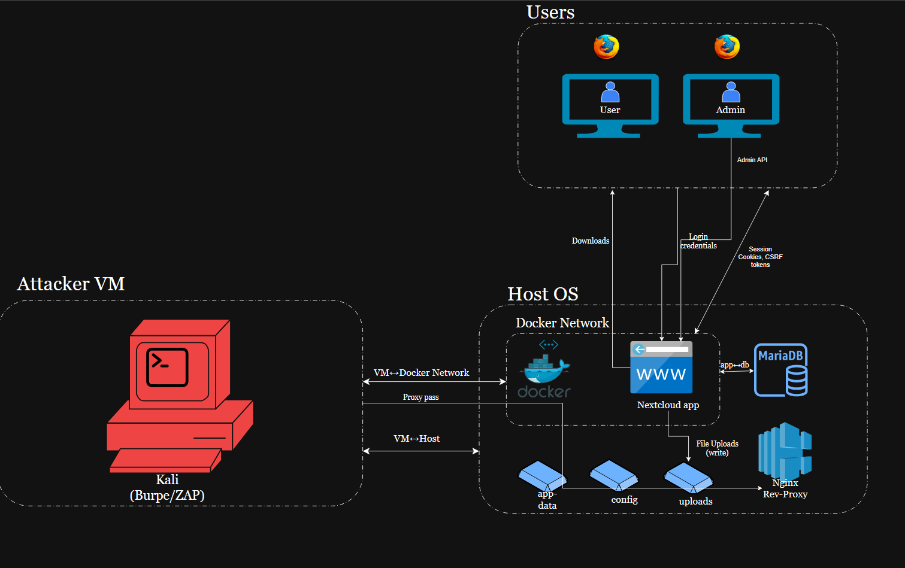

# Nextcloud Lab — Data Flow Diagram (DFD)

This README matches the current DFD (`threat-model/diagram.drawio.png`). The editable file is `threat-model/diagram.drawio`.

## Diagram

## Topology (as shown)

- **Users** (outside all host/VM boundaries): two browser clients labelled **User** and **Admin**.
- **Attacker VM**: **Kali (Burp/ZAP)** inside its own **VM** trust boundary.
- **Host OS**: outer trust boundary that contains:
  - **Docker Network** (inner dashed boundary) with:
    - **Nextcloud app** (web UI + WebDAV endpoint)
    - **MariaDB**
    - **App↔DB split** (thin dashed vertical line labelled `app↔db`)
  - **Host Volumes**: `app-data`, `config`, `uploads` (three storage tiles)
  - **Nginx Reverse Proxy** (optional TLS termination and routing)

## Trust Boundaries (visual style)

- **VM** around Kali.
- **Host OS** around Docker elements, volumes, and Nginx.
- **Docker Network** around **Nextcloud app** and **MariaDB**.
- **Edge labels** where they meet: `VM↔Host`, `VM↔Docker Network`, plus the interior `app↔db` split line.

## Numbered/Named Flows in the diagram

The diagram uses arrow labels (orthogonal connectors). Add numeric badges if your rubric requires 1–9.

- **Login credentials** — Browsers → Nextcloud app (inside Docker Network).
- **Session cookies, CSRF tokens** — Nextcloud app ↔ Browsers (state-changing requests carry the CSRF token).
- **Downloads** — Nextcloud app → Browsers.
- **File uploads (write)** — Browsers → Nextcloud app → **uploads** volume.
- **App reads/writes data** — Nextcloud app ↔ **app-data/config/uploads** volumes.
- **App↔DB queries** — Nextcloud app ↔ MariaDB over the Docker bridge.
- **Admin API** — Admin browser → Nextcloud app.
- **Proxy pass** — Traffic can traverse **Nginx Reverse Proxy** → Nextcloud app (if enabled).
- **VM↔Host** and **VM↔Docker Network** — Labeled on the edges to show crossing trust zones from Kali.

> Security-sensitive items: credentials, session cookies, CSRF tokens, and WebDAV authentication (if used). Require HTTPS and secure cookie flags.

## Data at Rest and Keys

- **MariaDB**: users, shares, metadata.
- **Volumes**: `app-data`, `config`, `uploads` (includes files and potential secrets/keys).
- **Nginx**: TLS certs/keys if terminating TLS on host.

